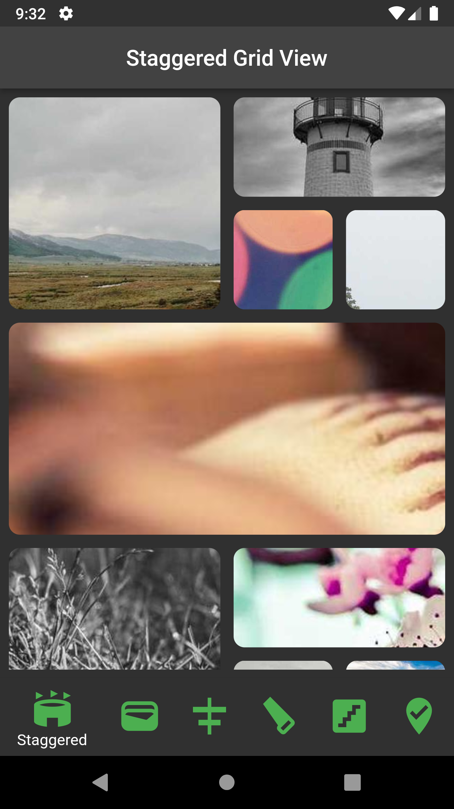
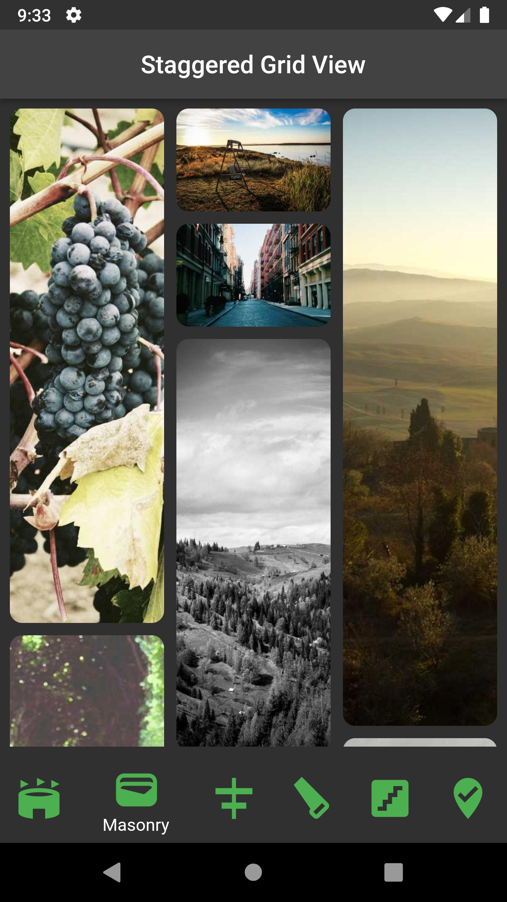
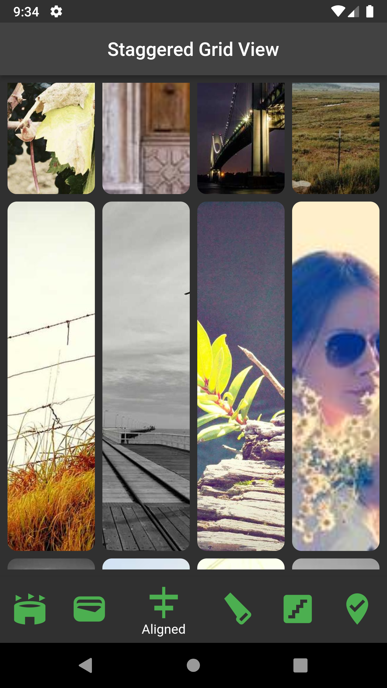
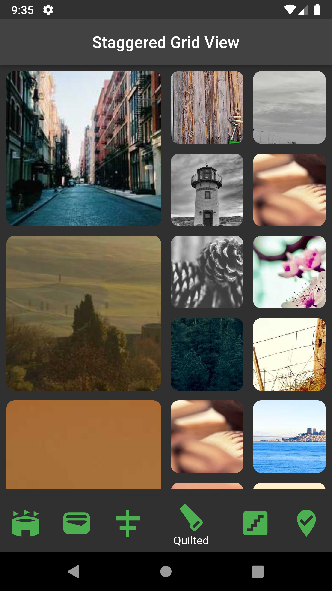
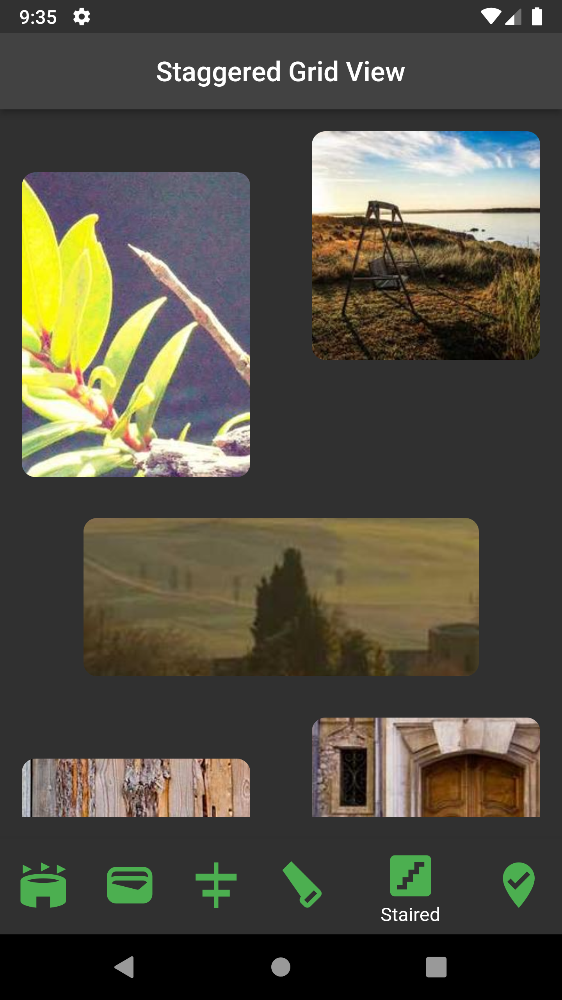
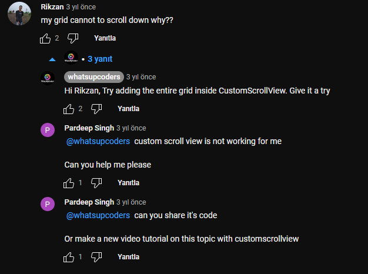
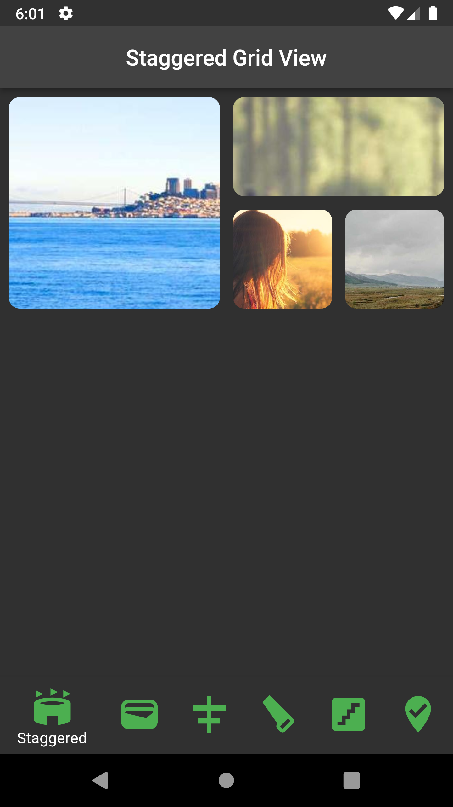

## 1. Research: staggered_grid_view


---Screenshots and media---

    
    
    


- Keywords:

  - flutter staggered gridview
  - flutter staggered gridview reorder
  - flutter staggered grid layout
  - flutter staggered grid layout android
  - flutter gridview builder
  - flutter gridview example
  - flutter staggered animation
  - flutter gridview builder in column
  - flutter gridview height
  - flutter GridView dynamic height
  - gridView builder flutter example
  - childAspectRatio gridview flutter
  - flutter_staggered_grid_view latest version

- Video Title: Flutter Staggered GridView [2022]

## 2. Research: Competitors

**Flutter Videos/Articles**

- https://pub.dev/packages/flutter_staggered_grid_view (Official package documentation)
- https://medium.flutterdevs.com/staggered-gridview-in-flutter-661f6667595d (Medium)
- https://www.geeksforgeeks.org/flutter-staggered-grid-view (Geeks For Geeks)
- https://levelup.gitconnected.com/gridview-and-staggered-gridview-in-flutter-ef5d999fcab0 (Level Up)
- https://github.com/abdulazizahwan/flutter-staggered-grid-view?ref=flutterawesome.com (Flutter Awesome - GitHub)
- http://androidcoding.in/2020/08/05/flutter-staggered-gridview/ 

- 21K - https://www.youtube.com/watch?v=h0H2t7fOGU4 (Fun with Flutter)
- 17K - https://www.youtube.com/watch?v=ABbBYebnwDQ (whatsupcoders)
- 13K - https://www.youtube.com/watch?v=wDoR302KSU4 (whatsupcoders)
-  2K - https://www.youtube.com/watch?v=6baVcfzSnJE (Backslash Flutter)

**Android/Swift/React Videos**

- 17K - https://www.youtube.com/watch?v=9l6Gjzpysmc (Android -> Java)

**Great Features**

- In [this](https://www.youtube.com/watch?v=6baVcfzSnJE) video, he uses latest features of staggered_grid_view package which are MasonryGridView, AlignedGridView etc.


**Problems from Video**


- In [this](https://www.youtube.com/watch?v=h0H2t7fOGU4) video, he used a deprecated constructor (at 2:05).
**Answer: You can add a newer version of package.


- In [this](https://www.youtube.com/watch?v=ABbBYebnwDQ)
**Answer: You can wrap StaggeredGrid.count() widget with SingleChildScrollView() widget.



- In [this](https://www.youtube.com/watch?v=ABbBYebnwDQ)
**Answer: You can wrap StaggeredGrid.count() widget with SingleChildScrollView() widget.


**Problems from Flutter StackOverflow**

- https://stackoverflow.com/questions/50435467/how-to-implement-in-flutter-a-staggered-grid-view
- https://stackoverflow.com/questions/65215128/staggered-grid-view-in-flutter
- https://stackoverflow.com/questions/67254943/flutter-staggered-grid-view-pin-tiles
- https://stackoverflow.com/questions/60868211/staggered-grid-view-not-scrolling-inside-listview
- https://stackoverflow.com/questions/58675132/lazy-loading-with-staggered-grid-view-in-flutter
- https://stackoverflow.com/questions/70003447/implementing-staggered-grid-view-with-multiple-selection-in-flutter
- https://stackoverflow.com/questions/58987982/how-can-i-create-staggered-grid-view-like-this-in-flutter
- https://stackoverflow.com/questions/71407450/flutter-staggered-grid-view-crossaxiscount-overrides-minwidth-of-item

## 3. Video Structure

**Main Points / Purpose of Lesson**

1. From the docs, The GridView is a scrollable, 2D array of widgets. It is basically used to lay the items in a tabular grid fashion. In case of using different size widgets (Card,Image,PNG etc.) in a grid view outputs undesired results.

2. To prevent these results we use StaggeredGridView package.
    2.1 - Staggered gridview consists of multiple columns with different rows with varying sizes used to display different sizes' images or sized widgets.
    2.2 - The main feature of Staggered Grid View is that it makes the layout beautiful and develop a great user experience.

3. StaggeredGridView is a new enhanced variant of GridView. We can resize widgets on specific layouts on demand.
Also, there are built-in layouts in this package which are masonry, aligned, staired etc.

**The Structured Main Content**
- When we looked at GridView widget, there are some unavoidable constraints. For example, you have a few different size images and you want to show them as it is. You can not achieve that with GridView widget. At this point we can apply StaggeredGridView package. It provides us various built-in layouts, or custom layouts. With small modifications you can create your own patterns and more.

- `flutter_staggered_grid_view` already comes with a list of layouts, like:
  - `staggered`
  - `masonry`
  - `aligned`
  - `quilted`
  - `staired`
  - `woven`


- For using the `flutter_staggered_grid_view` we need to add this package.

```yaml
    flutter_staggered_grid_view: ^0.6.2
```


- Import the package.

```dart 
import 'package:flutter_staggered_grid_view/flutter_staggered_grid_view.dart';   
```

- Create a stateless widget

```dart 
class MainPage extends StatelessWidget {
  const MainPage({super.key});

  @override
  Widget build(BuildContext context) => Scaffold(
        body: Container(),
      );
} 
```

- Add StaggeredGrid.count() constructor to the Scaffold's body.

```dart 
class MainPage extends StatelessWidget {
  const MainPage({super.key});

  @override
  Widget build(BuildContext context) => Scaffold(
        body: Padding(
          padding: const EdgeInsets.all(8.0),
          child: SingleChildScrollView(
            child: StaggeredGrid.count(
              crossAxisCount: 4,
              mainAxisSpacing: 12,
              crossAxisSpacing: 12,
              children: items,
            ),
          ),
        ),
      );
} 
```
- Create ImageCard stateless widget with Image.network().

```dart 
class ImageWidget extends StatelessWidget {
  const ImageWidget({
    Key? key,
  }) : super(key: key);

  @override
  Widget build(BuildContext context) {
    int photoId = Random().nextInt(30) + 55;
    int sizeMultiplier = photoId % 7;

    return ClipRRect(
      borderRadius: BorderRadius.circular(10),
      child: Image.network(
        "https://picsum.photos/id/$number/300/${200 * sizeMultiplier}",
        scale: 1,
        fit: BoxFit.cover,
      ),
    );
  }
}
} 
```

- Create StaggeredGridTile list and provide to StaggeredGrid.count() as children.

```dart 
List<StaggeredGridTile> items = const [
  StaggeredGridTile.count(
    crossAxisCellCount: 2,
    mainAxisCellCount: 2,
    child: ImageWidget(),
  ),
  StaggeredGridTile.count(
    crossAxisCellCount: 2,
    mainAxisCellCount: 1,
    child: ImageWidget(),
  ),
  StaggeredGridTile.count(
    crossAxisCellCount: 1,
    mainAxisCellCount: 1,
    child: ImageWidget(),
  ),
  StaggeredGridTile.count(
    crossAxisCellCount: 1,
    mainAxisCellCount: 1,
    child: ImageWidget(),
  ),
  StaggeredGridTile.count(
    crossAxisCellCount: 4,
    mainAxisCellCount: 2,
    child: ImageWidget(),
  ),
  ]; 
```


- The output similarly will be as shown below.

